🙆‍♀️🙆‍♀️🙆‍♀️🙆‍♀️🙆‍♀️🙆‍♀️🙆‍♀️🙆‍♀️🙆‍♀️🙆‍♀️🙆‍♀️🙆‍♀️🙆‍♀️🙆‍♀️🙆‍♀️🙆‍♀️🙆‍♀️🙆‍♀️🙆‍♀️🙆‍♀️🙆‍♀️🙆‍♀️🙆‍♀️🙆‍♀️🙆‍♀️🙆‍♀️🙆‍♀️🙆‍♀️🙆‍♀️

🙆‍♀️  **注意**：如果对技术感兴趣的朋友，请一定一定一定要看我的==技术亮点部分==！！！       🙆‍♀️

🙆‍♀️  			写的==非常认真==，每个功能我都研究了很久，一定要看                                          🙆‍♀️

🙆‍♀️🙆‍♀️🙆‍♀️🙆‍♀️🙆‍♀️🙆‍♀️🙆‍♀️🙆‍♀️🙆‍♀️🙆‍♀️🙆‍♀️🙆‍♀️🙆‍♀️🙆‍♀️🙆‍♀️🙆‍♀️🙆‍♀️🙆‍♀️🙆‍♀️🙆‍♀️🙆‍♀️🙆‍♀️🙆‍♀️🙆‍♀️🙆‍♀️🙆‍♀️🙆‍♀️🙆‍♀️🙆‍♀️


  

# 项目名称

码神博客


# 项目概述

基于SpringBoot 的前后端分离的单体应用项目，主要用于平时的技术总结和技术栈的积累。主要的功能有文章发布、图片上传、用户登录、标签管理、文章归档。


# 截图

- 首页

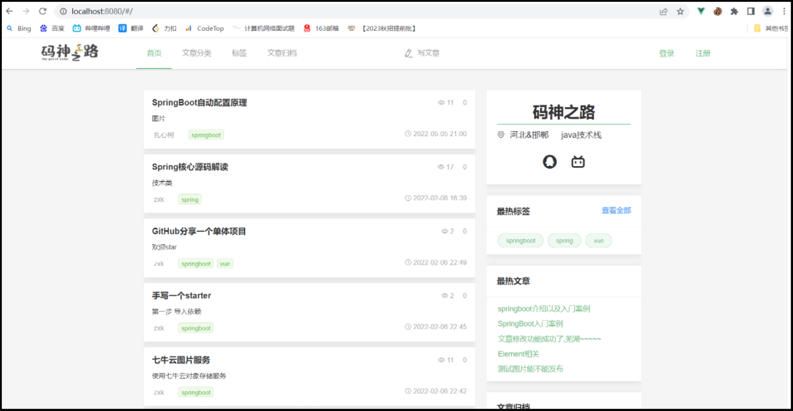

- 文章分类


- 标签分类


- 文章归档

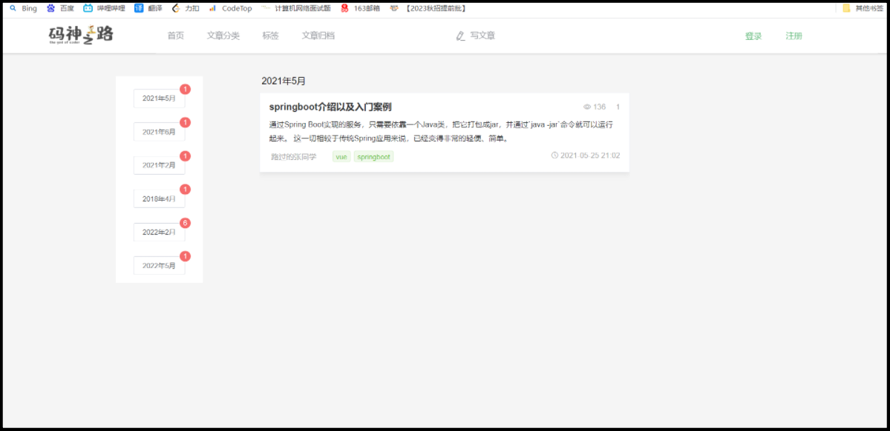

- 文章阅读

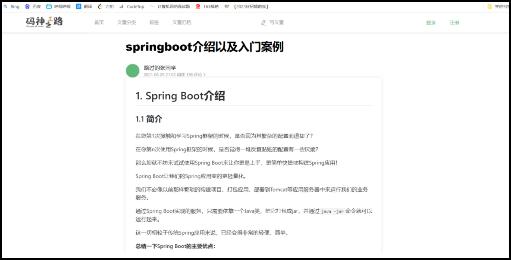


# 技术亮点（遇到问题+ 解决方案）

1. ==单点登录问题==：使用使用 JWT+Redis 实现单点登录功能，优点是用户访问和认证速度块，并且相比于cookie更加安全  

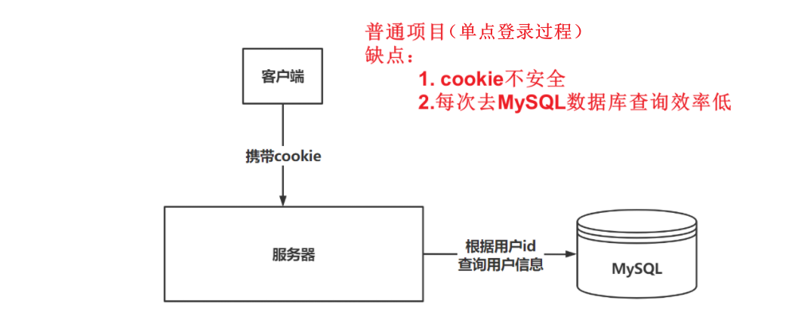

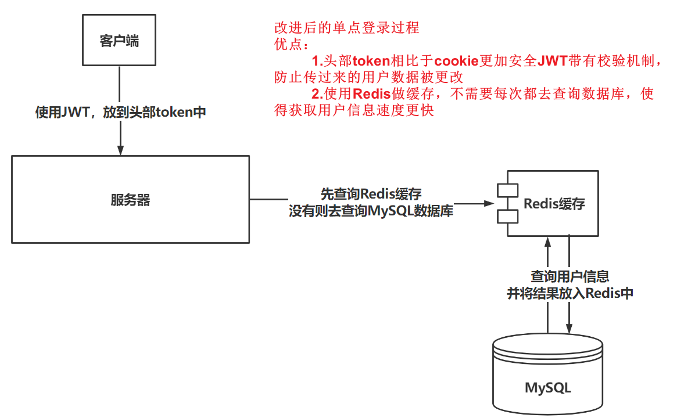

---


2. ==用户信息获取问题==：使用ThreadLocal保存用户信息，请求的线程之内可以随时获取登录用户的信息，在后置拦截器中做了value的删除，防止了内存泄露  

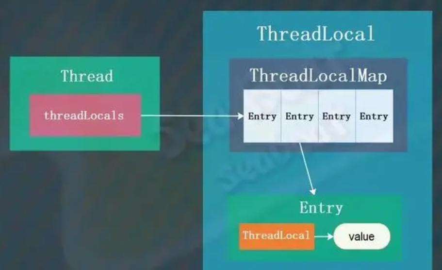

```shell
线程私有变量，相当于在这个线程的声明周期内，可以随时获取这个变量的值
```

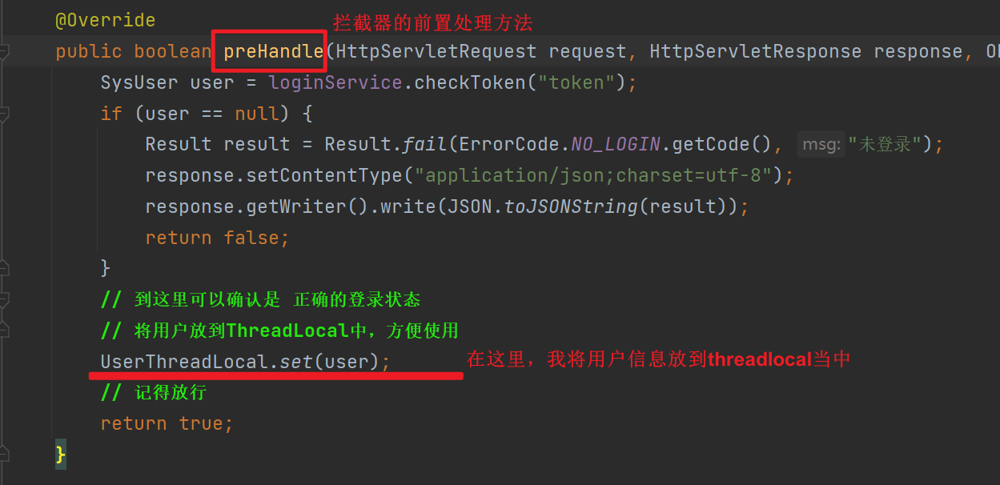

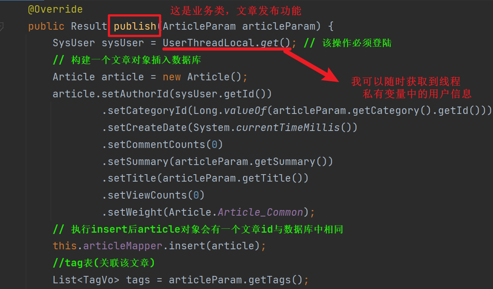

最后一定不要忘记，在拦截器的后置处理方法中，手动清除value，防止内存泄露的风险

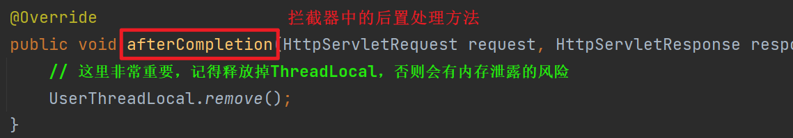

```shell
# 谈谈我对threadlocal内存泄露的理解（原因 + 结局方案）
 	内存泄露：不再会被使用的对象占用的内存不能被回收，就是内存泄露，一般发生在堆中
  	强引用：使用最多的引用，平常使用的new和反射获取的对象就是强引用，不会被垃圾回收器回收，当内存空间不足时，JVM宁愿抛出OOM异常也不回收这种对象如果想回收这个对象，可以将其引用赋值为null，JVM就会在合适的时间回收   
    弱引用：JVM进行内存回收时，无论内存是否充足，都会将其回收，对应的类就是=> java.lang.WeakReference
    
----------------------------------------------------------------------------------------------------------
理解了这些名词，下面来看解释：
        首先，先放结论，解决内存泄露，就是释放堆中key引用的堆的对象和value引用的堆中的对象。具体的解决方案是使用弱引用回收threadlocal的key，使用remove回收threadlocal的value，才能避免内存泄露问题
        (1)Thread内的threadlocalmap生命周期跟thread一样，都是线程生命周期结束才回收，这就导致一个问题，就算我们栈帧中释放了
           threadlocal，但是由于threadlocalmap的entry中还存有threadlocal的引用，并且我访问不到，所以这个threadlocal不
           能被释放，value也是同理导致了内存泄露。
        (2)解决key的问题，使用弱引用，只要栈帧中释放了threadlocal的强引用，JVM就会回收key在堆中的对象
        (3)解决value的问题，需要程序员显示使用remove方法，将value置位null，JVM才会回收value对象

----------------------------------------------------------------------------------------------------------  
所以，为了避免内存泄露问题，建议程序员：
        (1)使用threadlocal需要手动调用remove方法，来释放value     
        (2)我自己的心得，在使用threadlocal的时候，将threadlocal设置为静态变量，防止这个引用找不到引发内存泄露的问题
```

---


3. 文章页面打开速度慢问题：优化代码逻辑，将原先访问页面请求中修改文章阅读次数的操作，提交到线程池中进行。  

问题是这样的，一个博客，最最最影响用户体验的就是文章的打开速度，为了优化这个，我进行两方面的操作

- 一方面，将图片资源放到七牛云，减少系统带宽压力

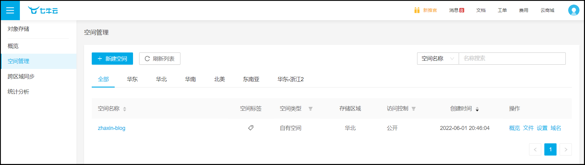

改进前的系统：带宽1M，一篇文章图片和文字加在一起约0.5M，服务器每秒同时服务2个用户就到上线

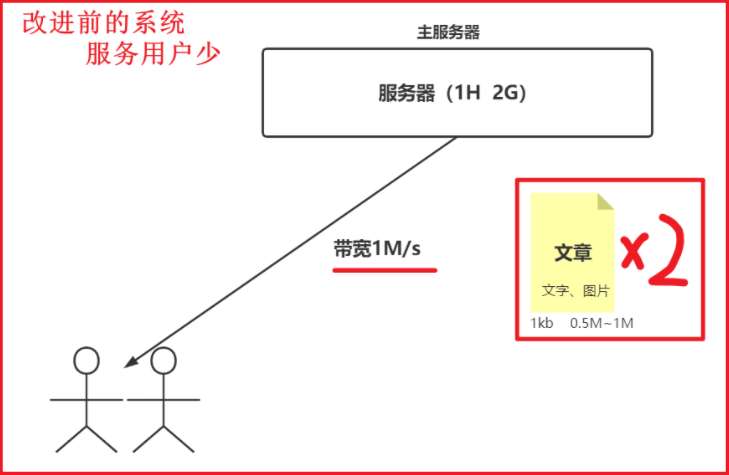

改进后的系统：服务器带宽1M，文字16KB，约200多字，可以同时发1024 * 1024 / 16 篇文章。

​							资源服务器50M，图片约0.5M，可以同时发50 / 0.5 张图片

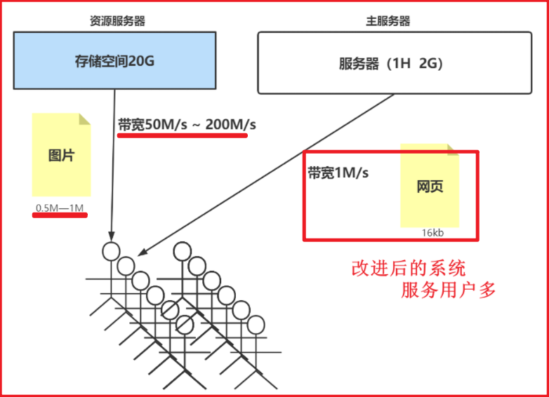

- 另一方面，优化文章查询功能的处理逻辑

```shell
以前：用户点击文章进行观看，返回结果的逻辑中，需要增加这篇文章的观看次数
改进：将修改文章次数的任务提交给线程池，异步操作，直接返回结果，这样一来速度自然一下就上来了
```

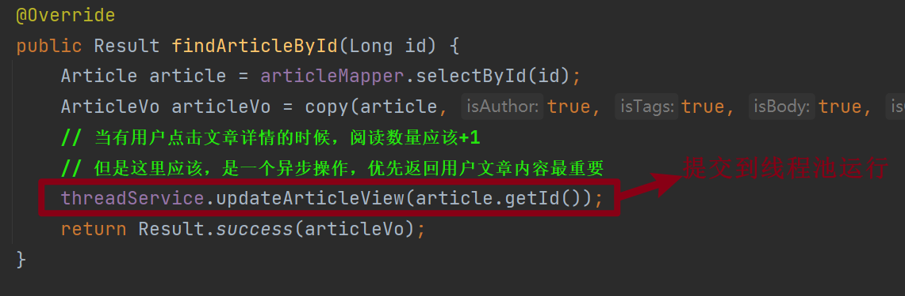

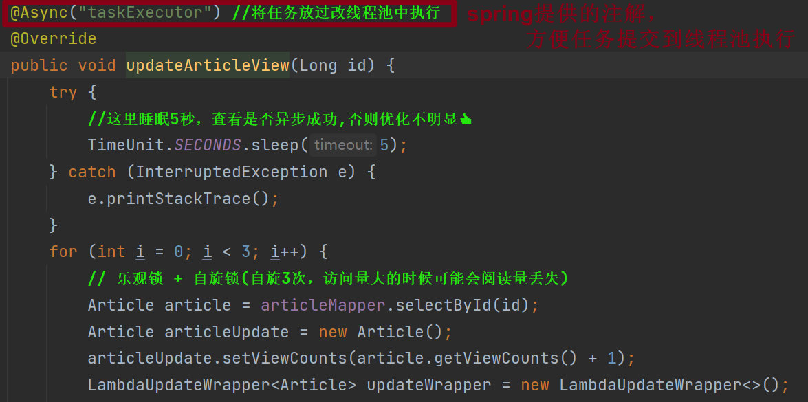

---


4. ==日志处理和缓存处理问题==：使用 AOP+注解+反射 进行统一的日志和缓存处理  

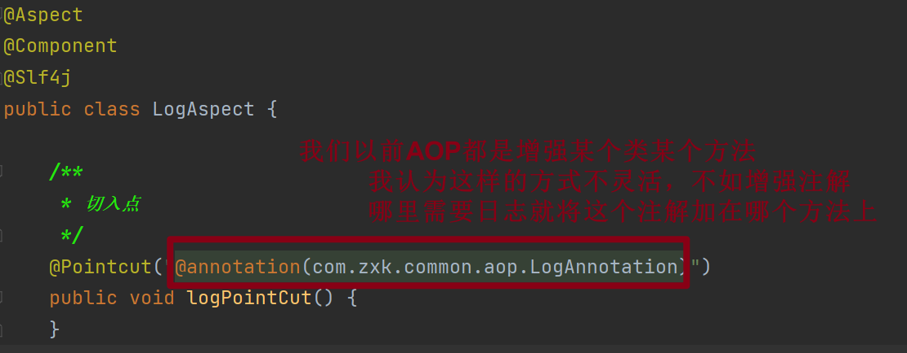

具体一些反射的操作

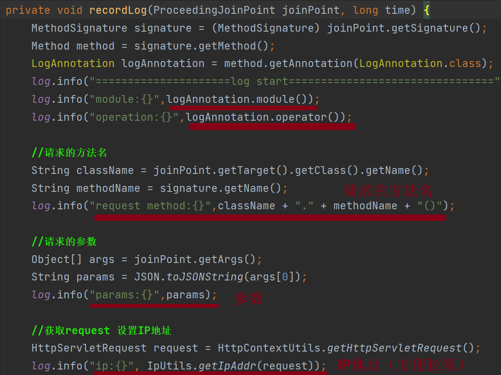

缓存操作，也是同理

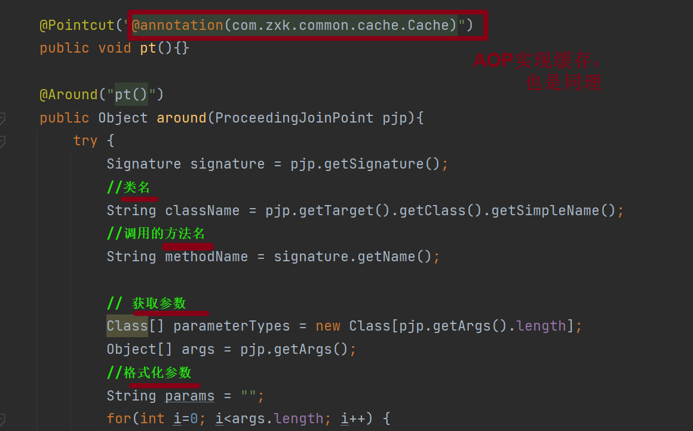


5. 缓存一致性问题：修改文章内容操作，先修改数据库，后删除缓存，解决并发下的缓存不一致。删除缓存使用的是RabbitMQ，关闭自动应答，解决Redis如果出现故障的缓存不一致性  

这个**非常重要**，我为此专门写了一篇博客，用来解释为什么要这么做，下面就是内容

🍖🍖🍖🍖🍖🍖🍖🍖🍖🍖🍖🍖🍖🍖🍖🍖🍖🍖🍖🍖🍖🍖🍖🍖🍖🍖🍖🍖🍖🍖🍖🍖🍖🍖🍖🍖


# ==讲讲项目中的缓存一致性问题==

具体就是文章编辑功能，应该先修改数据库，还是先修改缓存

- 先修改缓存，再修改数据库

如果缓存修改成功，数据库修改失败，这是非常严重的生产问题

			比如用户注册了，操作半天，但是一查数据库根本没有该用户

---

- 先修改数据库，再修改缓存

如果数据库修改成功，缓存修改失败，用户看到的就是旧数据，但是只持续一个缓存的失效时间

			所以，我要从并发的角度回答这个问题

```xml
线程1 修改数据库A=1
					线程2 修改数据库A=2
					线程2 修改缓存A=2
线程1 修改缓存A=1
```

这里的A=1，就是一个脏数据，存在风险

---

以上两种都不保险，还剩下两种方案

- 先删除缓存，再修改数据库

```xml
线程1 删除缓存A=1
					线程2 查询缓存不存在，去数据库中读取旧值A=1
					线程2 修改缓存A=1
线程1 修改数据库A=2  
```

这里的A=1，还是一个脏数据，存在风险

- 再修改数据库，再删除缓存

```xml
线程1 缓存失效，读取数据库A=1
							线程2 修改数据库A=2
							线程2 删除缓存
线程1 修改缓存A=1
```

可以看到，这里存在脏数据问题，但是这种可能性很小，写数据库操作要加锁，花费时间更长，不太可能将读数据库的两个操作分割开来，所以可以放心使用这种方案。

=========================>

另外，这个问题，如果从一般角度已经回答完了，但是我这个项目中还使用到了RabbitMQ消息队列

用于解决修改数据库成功，删除缓存失败的情况

这种情况下，使用的是**异步重传**的机制，将消费者的自动应答设置为false，如果删除redis缓存失败，旧再次尝试


